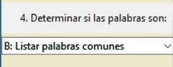
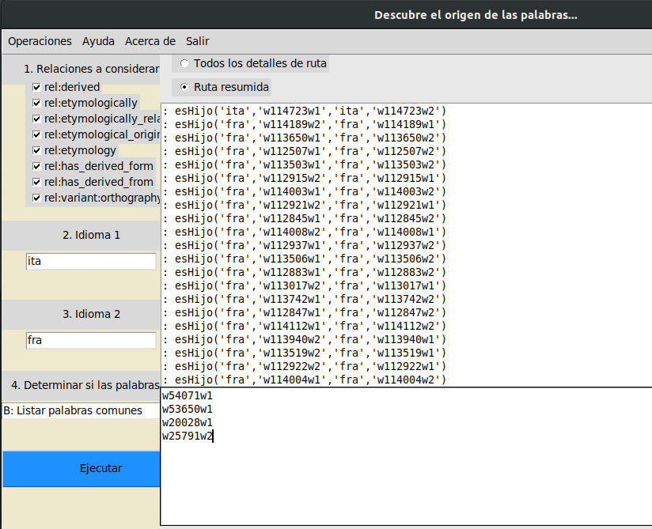

# Proyecto 2: Relaciones de Etimología

*Marcello Ávila, Stefi Falcón, Nelson Gómez* | Inteligencia Artificial -  Tecnológico de Costa Rica

## Introducción
La lógica representa un papel básico en la informática y en campos como la Inteligencia Artificial, específicamente en la creación de agentes basados en lógica. De aquí se deriva también la lógica de primer orden, que por medio de un conjunto de predicados y cuantificadores se pueden realizar inferencias.

Por otra parte, la etimología es un campo que estudia el origen de las palabras, debido a que muchos idiomas actuales tienen interrelaciones basadas en raíces comunes.
A partir de los conceptos anteriormente mencionados, se presenta el proyecto a realizar, el cual básicamente tiene como intención exponer el procesamiento de datos mediante un motor de derivación lógico.

Para realizar el proyecto, se utilizará un lenguaje de lógica sobre el lenguaje de programación Python, llamado PyDatalog, y una base de datos de relaciones etimológicas proveniente de “Etymological Wordnet”, que recopila relaciones entre palabras de distintos idiomas.

La idea principalmente es que se pueda construir un sistema basado en proposiciones lógicas que nos permita responder preguntas relacionadas al origen común de las palabras, similitud de los lenguajes, etc.  


## Instalación

El lenguaje de derivación utilizado será PyDatalog, el cual consiste en una librería que permite solucionar problemas de lógica utilizando el paradigma de programación lógico.
Dicha librería requiere una instalación, cuyos pasos serán mencionados a continuación.

* El primer requisito es tener instalado Python 3.6. Si el sistema operativo es Windows, se puede descargar el ejecutable por medio de la siguiente dirección:
```
  https://www.python.org/downloads/
```
* Para realizar su instalación en Linux, utilizar el siguiente comando, en la terminal:
```
pip install pyDatalog
```
* Para realizar la instalación de este segundo proyecto programado, del curso Inteligencia Artificial, primero deberá de descargar el archivo tec-0.1.zip; y posteriormente, deberá de ejecutar, en línea de comandos, la instrucción que se especifica a continuación:
```
pip install tec-0.1.zip -t <directorio>
```
* Descargar la base de datos Etymological Wordnet y colocarla en la carpeta raíz:
```
https://cs.rutgers.edu/~gd343/downloads/etymwn-20130208.zip
```

## Manual de usuario
El primer paso a realizar, es seguir las instrucciones del apartado "Instalación", del presente documento.

Posteriormente a haber realizado las instalaciones necesarias, se procederá a ejecutar el programa, por medio de la siguiente instrucción:

```
python3 g04.py
```

El cual desplegará la interfaz principal. Donde en en la barra de menu se tienen las opciones de Operaciones, Ayuda, Acerca de y Salir.
En operaciones se cuenta con las operaciones principales del programa, operaciones entre palabra-palabra, palabra-idioma e idioma-idioma.


Luego, una vez seleccionada una opción, se desplegarán todos los wigets según la operación seleccionada.


La ventana principal, cuenta con el panel "Relaciones a considerar", que posee un conjunto de checkboxes, que servirán para que el usuario pueda seleccionar el tipo de relación que desea utilizar durante la consulta a realizar:


Al lado izquierdo de la ventana, se encontrarán dos casillas de texto. El usuario deberá de introducir las palabras a comparar:


Ahora, el usuario debe seleccionar la operación que desea ejecutar. Para ello, deberá de seleccionarla de la siguiente lista:



Por último, el usuario debe de oprimir el botón "Ejecutar":


Después de realizar los pasos previamente descritos, al lado derecho de la ventana, se muestran dos paneles: uno de ellos mostrará los resultados de la consulta; y en el otro, se podrá ver todas las relaciones entre palabras realizadas para poder llegar a dicho resultado.

En la parte superior derecha de la ventana, se encontrarán dos opciones:
"Todos los detalles de ruta" y "Ruta resumida". La primera opción, muestra de manera extendida las relaciones que se hicieron entre todas las palabras para poder llegar a un resultado. La segunda, mostrará un resumen de las mismas:

 

Panel en el que se muestran las relaciones elaboradas para llegar a un resultado:


En la parte inferior derecha de la pantalla se encontrará el campo de texto en el cual se mostrará la respuesta a la consulta:


## Detalles de implementación y diseño

### Interfaz gráfica
Para la implementación de la interfaz de usuario, se utilizó TkInter que es una librería estandar y multiplataforma para el desarrollo de interfaz grafica de usuario para Python.

Como se observa en las imagenes anteriores la interfaz está divida en 3 secciones principales. Primero se tiene el panel de control, luego la ventana superior que muestra la ruta de la inferencia generada segun la consulta realizada y por último se tiene la ventana inferior, que corresponde al campo donde se mostrará el resultado final. 

La ventana principal cuenta con un menuBar, dónde en una de las operaciones se puede elegir si se desea realizar una consulta entre palabra-palabra, palabra-idioma o idioma-idioma. Una vez una opción es elegida se llama la función respectiva que dibuja los checkboxs, entrys, textFields según las opciones de la operación.


Como se puede observar, según la opción todos los wigets se dibujan en la ventana root, lo cual implica que no se crearan ventanas extra. 

Un punto importante a destacar, es el listener con el que cuentan los checkbox del panel en la parte superior, cada vez que uno de los checkbox es marcado o desmarcado, se hace un llamado al a función var_states(), que básicamente se hace un llamado para cargar o quitar las relaciones a considerar durante la consulta.
Como se puede observar en la siguiente imagen, los parámetros que recibe dicha función es un valor booleando de si el checkbox está marcado o no, que será exactamente el dato que se le enviará a la función de cargar relaciones.


El llamado a la ejecución de la consulta especifica es otro punto importante en la interfaz gráfica. Primero que nada se capturan los valores seleccionados por el usuario dentro de variables, luego las variables son enviadas a una funcion llamada run_query, dónde básicamente primero verifica si viene de la opción palabra-palabra, palabra-idioma o idioma-idioma, luego verifica qué opción fue elegida en el comboBox para llamar a la función específica y por último hace el llamado a la función según corresponda.
Como se observa en la siguiente imagen, si una persona ingresa a la operación de palabra-palabra, completa los datos, selecciona en el combobox la opción A (que corresponde al a operación de saber si 2 palabras son hermanas) y ejecuta la consulta, el programa ingresaría a la siguiente sección de código donde se hace el llamado a la función de hermanas. El dato que se le envia son los 2 strings escritos por le usuario.


### Manejo de los datos
La base de datos a manipular contiene el siguiente formato:

```
idioma: palabra tipoRelación idioma: palabra
```
A continuación se muestra un ejemplo del formato escrito:
```
eng: war rel:has_derived_form eng: war crime
```


Donde, eng representa el idioma inglés; war representa la palabra guerra; rel:has_derived_form, representa el el tipo de relación entre esas dos palabras; y crime, significa la palabra que se encuentra relacionada con la primera mencionada.

Además existen ocho tipos distintos de relaciones para las palabras, las cuales son:

1. rel:derived     
2. rel:etymologically
3. rel:etymologically_related
4. rel:etymological_origin_of
5. rel:etymology
6. rel:has_derived_form
7. rel:is_derived_from
8. rel:variant:orthography

Y poseen la siguiente estructura:

| Relación | Dirección |
| --- | --- |
| derived | Padre ➡ Hijo |
| etymologically_related | Hijo ➡ Padre |
| etymological_origin_of | Padre ➡ Hijo |
| etymology | Hijo ➡ Padre |
| has_derived_form | Padre ➡ Hijo |
| is_derived_from | Hijo ➡ Padre |
| variant:ortography | Hijo ➡ Padre |

Dónde se descubre que las relaciones rel:etymological_origin_of y
rel:etymology, son simétricas. Esto debido a que ambas relaciones tienen la misma cantidad de hechos, en el archivo inspeccionado. Para ser exactos: 473433 hechos.

| Relación | Cantidad de registros | Contrapuesta |
| --- | --- | --- |
| derived | 2 | Ninguna |
| etymologically | 1 | Ninguna |
| etymologically_related | 538558 | Ninguna |
| etymological_origin_of | 473433 | etymology |
| etymology | 473433 | etymological_origin_of |
| has_derived_form | 2264744 | is_derived_from |
| is_derived_from | 2264744 | has_derived_form |
| variant:orthography | 16516 | Ninguna |


El mismo caso sucede con las relaciones has_derived_form y is_derived_from.


## Procesamiento de la base de datos
 
La base de datos de Etymological Wordnet (etymwn.tsv), es un archivo separado por tabulaciones, que describe los distintos tipos de relaciones etimológicas, una por linea, relacionando una palabra con otra, contando en total 6.031.429 relaciones.
 
El paradigma de programación lógico, requiere cargar estas relaciones a memoria para que el motor PyDatalog pueda resolver consultas, sin embargo, la base de datos pesa ~300MB, por lo que el proceso de carga y búsqueda sobre estos datos es considerablemente pesado. Esto motiva al equipo a buscar métodos eficientes de procesamiento de la entrada para acelerar la carga y aumentar la usabilidad de la herramienta
 
### Hechos
Un hecho de pyDatalog se define con una relación y una cantidad N de elementos. Esta relación puede tener un nombre cualquiera, que será definida por los mismos hechos. Los hechos tendrán la siguiente sintáxis:
```
relación(elemento1, elemento2, ..., elementoN)
```
 
### Carga en pyDatalog por assert_fact()
Uno de los métodos de carga de hechos dentro del motor de PyDatalog, es cargar una sola sentencia de la manera
```
assert_fact('relación(elemento1, elemento2, ..., elementoN)')
```
Por lo que se ejecuta la instrucción por cada una de las lineas de la base de datos.
 
### Carga en pyDatalog por load()
El otro método para agregar hechos al motor, es por medio de la función `load()` que evalúa un string y lo descompone por cambios de linea. Esto permite cargar múltiples hechos con una sola instrucción.
 
### Utilización de memoria
 
Cada una de las relaciones que se guardan en la base significa los bytes del nombre de la relación, y de cada uno de los elementos. Así, cargar toda la base puede significar en aprox. 6.1GB, lo que típicamente en una computadora con 8GB de RAM y 4 procesadores de 2.8GHz, hasta 15-20min. sto reduce considerablemente la usabilidad de la herramienta pues requiere un largo tiempo de espera de arranque.
 
### Acercamientos para optimizar la utilización de la herramienta
El extenso tamaño de la base de datos, provee un reto computacional con múltiples puntos de exposición de errores. Por lo tanto es importante conocer cuales de las 3 operaciones para cargar hechos pueden tardar más que retracen el proceso.
 
La carga de hechos desde la base de datos a la memoria se descompone en los siguientes pasos repetitivos:
 
1. Leer la linea del archivo
2. Descomponer la linea en sus 5 partes, separadas por tabulaciones o dos puntos (:):
  - Idioma de la palabra de la izquierda
  - La palabra de la izquierda
  - El tipo de relación etimológica
  - Idioma de la palabra de la derecha
  - La palabra de la derecha
3. Crear la relación según el tipo de relación
 
#### Hilos
Los hilos pretenden ejecutar múltiples tareas de de la creación de hechos, al mismo tiempo. De esta manera se puede ir recorriendo la base de datos, delegando la carga de hechos a la base de datos.
 
Por el tipo de entrada, por medio de un archivo, lo mejor es hacer tal procedimiento de forma secuencial para evitar conflictos de lectura. Lo que se puede ejecutar de manera asincrónica, es la carga de los hechos.
 
El flujo a seguir consiste en ir leyendo todas las lineas de la base de datos, agruparlas en strings de 100 lineas, y al haber 100 lineas, crear e iniciar un hilo y continuar leyendo el archivo. El hilo será quien se encarga de efectuar la función load() o assert_fact() con un string.
 
El comportamiento observado fue que la lectura del archivo, podía terminar en unos 3 minutos con toda la base de datos. Sin embargo, investigando sobre PyDatalog, la librería es thread-safe, lo que incluye un manejo interno de semáforos para evitar conflictos de recursos. Por lo tanto los hilos están en una cola de espera. Aun cuando la lectura sea rápida, la cola tarda los mismos 15-20 minutos. Esto revela que el verdadero cuello de botella con la herramienta, es la creación de hechos en la memoria.
 
#### Agrupaciones de hechos
Este acercamiento busca probar si la función load con múltiples lineas y hechos por carga es más efectivo que múltiples llamadas a la función load(). Sin embargo este rendimiento no sufrió ningun cambio significativo por lo que fue rechazado.
 
#### Uso de memoria
Como parte de la optimización de la herramienta, se pretendió reducir el uso de memoria para cargar las relaciones, se busca crear un índice de palabras, para que las relaciones tengan menos caracteres que almacenar.
 
Este método consiste en que al recorrer el archivo, se verifica si una palabra ya ha sido utilizada en el pasado y de ser así, se reutiliza el índice con la relación respectiva. Este índice se compone de la linea del archivo en que apareció la palabra y el lado de la relación en la linea.
 
```
wNumeroLineawLado
NumeroLinea: 5392
Lado: 1 | 2
 
w34w1
w34w2
w56w2
w1354w1
```
 
Para esto, se verifica si un diccionario contiene un índice para la palabra, y si no, se crea. Así se normaliza el espacio de las relaciones a strings de 4 a 10 caracteres como máximo, como por ejemplo los índices `w1w2` o `w6000492w1`. Además se crea el diccionario de palabras usadas que se carga en memoria.
 
Sin tal diccionario, y asumiendo una base de datos de 6.000.000 de registros, se cargarían 12.000.000 de palabras en memoria diferentes (aunque sean repetidas). En cambio, la base contiene aproximadamente 2.745.791 palabras diferentes por lo que se estarían ahorrando 9.317.067 palabras en la memoria. Estas serían sustituidas con su respectivo índice que en la mayoría de casos el índice es más corto que la palabra pues las palabras tienen una extensión media de 10 caracteres, cuando los índices ocupan desde 4 hasta 10 caracteres, donde estos tienen una media de 7 caracteres.
 
Estos índices permiten la recuperación de las palabras por medio de lecturas de acceso aleatorio en el archivo mediante la descomposión del índice y en muy reducidas ocasiones. En el caso de una consulta que diga cuáles palabras son derivadas de una, el motor resolverá la consulta para obtener unos 5 resultados, lo que permite leer el archivo 5 veces para buscar las respectivas lineas. Esta es una oprtunidad de optimización futura, de agrupar estas 5 lecturas en una sola lectura del archivo.


### Consultas

Las consultas son realizadas utilizando la función ask de pyDatalog.
```
ask(query)
```


Dónde query es un string que contiene  una consulta lógica, dicha función puede devolver dos tipos de valores: pyDatalog.Answer o None.

#### Desarrollo de las consultas
A continuación, se describirá el funcionamiento de cada una de las consultas elaboradas en PyDatalog:

**1. Palabras hermanas:** Devuelve verdadero, si dos palabras hijas, tienen el mismo padre. Para que una palabra tenga el mismo padre de la otra, el padre en común, debe de tener el mismo nombre e idioma.

```
sonElMismo(IH1, IH2, A, B, R) <= (IH1 == IH2) & (A == B)
sonHermanos(A, B, R) <= _getHijo(IP1, P1, IH1, A) & _getHijo (IP2, P2, IH2, B) & (sonElMismo(P1, P2, IP1, IP2, R3))  & ~(sonElMismo(IH1, IH2, A, B, R2) )
sonHermanos(A, B) <= sonHermanos(A, B, R)
```

**2. Palabras primas:** Dos palabras se consideran primas, si los padres de ambas son hermanos.
```
sonPrimos(P1, P2, G, True) <= sonPrimos(P1, P2, G )
sonPrimos(P1, P2, 0, False) <= ~sonPrimos(P1, P2, G)
sonPrimos(P1, P2, G) <= esHijo(P1, PP1) & esHijo(P2, PP2) & sonHermanos(PP1, PP2) & (G==1)
sonPrimos(P1, P2, G) <= esHijo(P1, PP1) & esHijo(P2, PP2) & ~sonHermanos(PP1, PP2) & sonPrimos(PP1, PP2, G1) & (G==G1+1)
sonPrimas(P1, P2) <= sonPrimos(P1, P2, G)
```
**3. Palabra hija de otra:** Esta búsqueda devuelve verdadero al buscar el padre de la supuesta hija, y que este último sea igual que el supuesto padre (palabra e idioma de la palabra padre).

```
esHijo(H, P) <= esHijo(IP, P, IH, H)
esHijo(H, P, R) <= esHijo(IP, P, IH, H) & ~sonElMismo(IP, IH, P, H, X)
```

**4. Palabra tía de otra :** Para determinar si una palabra es tía de otra, lo primero es determinar el padre de la supuesta palabra sobrina, y el padre de este último; y con esto, se deterina si el tío y el padre de la palabra sobrina, son hermanos. Si esta última condición se cumple, la respuesta será verdadera; en caso contrario, falsa.

```
esTio(T, S, R) <= esHijo(S, P) & sonHermanos(T, P) & (P!=T)
getPadre(H, I)<=esHijo(IP, P, IH, H)
```

**5. Grado de prima:** Esta función retornará el grado de parentesco que tienen dos palabras primas. Para su desarrollo, se utilizó recursividad, mediante la cuál se logró implementar un contador que almacena el grado en que dos palabras son primas.

```
gradoPrimos(P1, P2, G) <= sonPrimos(P1, P2, G)
```
**6. Determinar si una palabra está relacionada con un idioma:** La lógica de esta consulta consiste en utilizando la palabra hija, obtener todos sus descendientes y ancestros, y verificar si es que alguno de estos coincide con el idioma de la búsqueda.

```
getHijos2(P, IH, H) <= esHijo(IP, P, IH, H)
descendientes(P, I, R) <= getHijos2 (P, I, R)
descendientes(P, I, R) <= getHijos2 (P, R_IH, R_H) & descendientes(R_H, I, R)
getPadres2(H, IP, P) <= esHijo(IP, P, IH, H)
ascendencia(H, I, R) <= getPadres2(H, I, R)
ascendencia(H, I, R) <= getPadres2(H, R_IP, R_P) & ascendencia(R_P, I, R)
```
**7. Obtener el conjunto de todas las palabras en un idioma originadas por una palabra específica:** Consulta similar a la número seis. Se buscan todos los descendientes y ancestros de una palabra y se retorna dicho resultado.

```
getHijosI(P, H, IH) <= esHijo(IP, P, IH, H)
hijosIdioma(P, IH, H) <= getHijosI(P, H, IH)
hijosIdioma(P, IH, R) <= getHijosI(P, H, IH) & hijosIdioma(H, IH, R)
```
**8. Listar los idiomas relacionados con una palabra:** Esta consulta es una extensión de la consulta siete. La variación que presenta es que se devuelven solo los idiomas obtenidos.

```
_soloIdiomas(P, I)<=_antepasados(P, I, R)
```
**9. Contar las palabras comunes entre dos idiomas:** Consulta derivada de la consulta número diez, se utiliza la función len_ para obtener el número de palabras comunes entre dos idiomas.

```
(numeroPalabrasComunes[I1, I2]==len_(R1)) <= palabrasComunes(I1, I2, R1)
contarPalabrasComunes(I1, I2, R1) <= (R1==[numeroPalabrasComunes[I1, I2]])
```
**10. Listar las palabras comunes entre dos idiomas:** Primero se filtran las palabras que se encuentran en los idiomas ingresados, y posteriormente, se compara palabra con palabra para revisar si es que existe una coincidencia entre idiomas, si la hubo, se muestra el resultado.
```
create_terms('getPalabrasXidioma, palabrasComunes, I1, I2')
getPalabrasXidioma(I, R) <= esHijo(IP, P, I, R)
getPalabrasXidioma(I, R) <= esHijo(I, R, IH, H)
palabrasComunes(I1, I2, R1) <= getPalabrasXidioma(I1, R1) & getPalabrasXidioma(I2, R2) & (R1==R2)
```
**11. Idioma que más aportó a otro:** Extensión de la consulta número doce. Se obtienen la lista de todos los idiomas que aportaron a otro idioma y mediante el uso de la función de agregación max_, se obtiene el nombre del idioma que más aportó a otro.

```
(mayorContribucion[IH]==max_(IP, order_by=T))<= (contribucionXidioma(IH, IP, T))
__mayorContribucion(IH, T) <=  (T==mayorContribucion[IH])
```

**12. Lista de todos los idiomas que aportaron a otro:** Para obtener la lista de todos los idiomas que aportaron a otro idioma, se utilizaron las funciones de agregación running_sum, que agrupa los resultados de una consulta según un criterio (en este caso, tipo de idioma), y suma el total de coincidencias.

```
rContPalabras(IH, R) <= (R==contPalabras[IH])
(contPalabras[IH]==sum_(T, for_each=IP)) <= (T==nPalabrasXidioma2[IH, IP])
(nPalabrasXidioma2[IH, IP]==running_sum_(T, group_by=IP, order_by=P))  <= getIdiomaPadre2(IH, IP, P, T)
getIdiomaPadre2(IH, IP, P, T) <= esHijo(IP, P, IH, H) & (IP!=IH) &(T==1)
(nPalabrasXidioma[IH, IP]==running_sum_(N2, group_by=IP, order_by=P))  <= getIdiomaPadre2(IH, IP, P, T) & (rContPalabras(IH, N) ) & (N2==100/N)
contribucionXidioma(IH, IP, T) <=  (T==nPalabrasXidioma[IH, IP])
```

## Análisis de resultados

## Operaciones entre palabras

### Determinar si dos palabras son hermanas


## Operaciones entre idiomas

### Contar todas las palabras comunes entre dos idiomas




### Idioma que más aportó a otro. Basado en porcentaje


## Distribución del trabajo


| Nombre | Nota |
| --- | --- |
| Marcello Ávila Feoli | 100 |
| Stefi Falcón Chávez | 100 |
| Nelson Gómez Alvarado | 100 |


Finalmente, en cuanto a la contribución de cada uno de los integrantes del equipo al proyecto, es importante mencionar que los tres miembros, participaron activa, equitativa e integralmente. A continuación, se detalla por cada estudiante, su contribución específica en el desarrollo de este proyecto:

*Marcello Ávila Feoli*
- Carga de datos y optimización del manejo de los mismos.
- Pruebas unitarias.
- Elaboración del informe del proyecto.

*Stefi Falcón Chávez*
- Elaboración de las consultas en PyDataLog.
- Elaboración del instalador utilizando Pip.
- Elaboración del informe del proyecto.

*Nelson Gómez Alvarado*
- Desarrollo de la interfaz gráfica del programa e integración de la misma con el backend.
- Elaboración del informe del proyecto.

Se puede concluir, con toda certeza, que fue un trabajo realizado en equipo, y con total sinergia, donde hubo una integración técnica de los conocimientos, pero de forma muy importante, también una unión muy personal y de compañerismo para conseguir satisfactoriamente una meta en común: realizar un proyecto que cumpliera de forma óptima con los requerimientos establecidos por el profesor.


## Referencias
* Base de datos Etymological Wordnet http://www1.icsi.berkeley.edu/~demelo/etymwn/

* Tutorial PyDatalog https://sites.google.com/site/pydatalog/Online-datalog-tutorial
